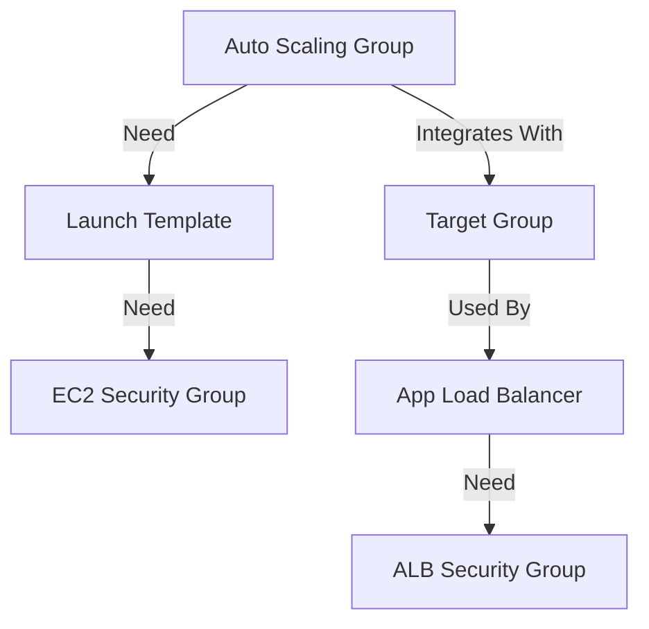

# AWS Auto Scaling Mastery: The Dependency-Driven Deployment Guide

This guide follows a **Dependency-Driven Approach** to deploying AWS infrastructure. Instead of memorizing a seemingly random order of operations, we follow the logical dependencies of the components: _ASG needs a Launch Template, which needs a Security Group, etc._

---

## 🎯 **Objective**

Deploy a scalable, self-healing web application using:

- **Auto Scaling Group (ASG)**
- **Launch Template**
- **Application Load Balancer (ALB)**
- **Target Group**
- **Security Groups**

---

## 🧠 **Core Principle: The "Just-in-Time" Workflow**

Don't memorize steps. Follow the needs of the architecture:



**Rule:** Build whatever is required _only_ when AWS asks for it.

---

## �️ **Step-by-Step Implementation**

### �🚀 **Step 1: Start with Auto Scaling Group**

1. Navigate to **EC2 Dashboard** → **Auto Scaling Groups**.
2. Click **Create Auto Scaling Group**.
3. **AWS Checkpoint:** It immediately asks for a _Launch Template_.
   - _Status:_ We don't have one.
   - _Action:_ Create it now.

### 🔧 **Step 2: Create Launch Template**

_(Dependency of ASG)_

1. Click **Create Launch Template**.
2. **Basic Configuration:**
   - **Name:** `ASG-Launch-Template`
   - **AMI:** Amazon Linux 2 (or 2023)
   - **Instance Type:** `t2.micro`
   - **Key Pair:** Select your existing key pair.
3. **AWS Checkpoint:** It asks for a _Security Group_.
   - _Status:_ We don't have one specific to this ASG yet.
   - _Action:_ Create it now.

### 🛡️ **Step 3: Create EC2 Security Group**

_(Dependency of Launch Template)_

1. Open a new tab → **EC2** → **Security Groups**.
2. Click **Create Security Group**.
3. **Settings:**
   - **Name:** `ASG-EC2-SG`
   - **Description:** Security group for ASG instances
   - **VPC:** Select your default/target VPC.
4. **Inbound Rules (Temporary):**
   | Type | Port | Source | Description |
   |------|------|--------|-------------|
   | HTTP | 80 | 0.0.0.0/0 | _Temporary access (will secure later)_ |

   > ⚠️ **Note:** Allowing 0.0.0.0/0 is temporary. We will lock this down to the Load Balancer later.

5. Click **Create**.

### 📜 **Step 4: Configure Launch Template Details**

1. Return to the **Launch Template** tab.
2. Hit refresh on the Security Group dropdown and select **`ASG-EC2-SG`**.
3. Scroll to **Advanced Details** → **User Data** and paste the following script:

```bash
#!/bin/bash
yum update -y
yum install httpd -y
systemctl start httpd
systemctl enable httpd

HOSTNAME=$(hostname)

echo "<html>
<head><title>ASG Demo</title></head>
<body style='background-color:lightyellow; text-align:center; font-family:Arial;'>
<h1>Auto Scaling Group Demo 🚀</h1>
<h2>Served from: $HOSTNAME</h2>
</body>
</html>" > /var/www/html/index.html
```

4. Click **Create Launch Template**.

### 🔄 **Step 5: Resume ASG Creation**

1. Return to the **Auto Scaling Group** tab.
2. Select **Launch Template** → `ASG-Launch-Template`.
3. Click **Next**.
4. **Network Settings:**
   - **VPC:** Select your VPC.
   - **Subnets:** Select **at least 2 public subnets** for high availability.
5. Click **Next**.
6. **AWS Checkpoint:** It asks to attach a _Load Balancer_.
   - _Status:_ We don't have one.
   - _Action:_ Create it now.

### 🎯 **Step 6: Create Target Group**

_(Dependency of ALB & ASG)_

1. Open a new tab → **EC2** → **Target Groups**.
2. Click **Create Target Group**.
3. **Settings:**
   - **Target Type:** Instances
   - **Protocol:** HTTP
   - **Port:** 80
   - **VPC:** Same as ASG.
   - **Health Check:** Path `/`
4. Click **Next** → **Create Target Group**.
   - _Note:_ Do NOT register instances yet. The ASG will handle this automatically.

### ⚖️ **Step 7: Create Load Balancer (ALB)**

_(Dependency of Target Group)_

1. Navigate to **EC2** → **Load Balancers**.
2. Click **Create Load Balancer** → **Application Load Balancer**.
3. **Basic Settings:**
   - **Name:** `ASG-ALB`
   - **Scheme:** Internet-facing
   - **IP Address Type:** IPv4
4. **Network Mapping:**
   - Select the same VPC.
   - Select the same **2 public subnets** used in ASG.
5. **AWS Checkpoint:** It asks for a _Security Group_ for the ALB.
   - _Status:_ We don't have one.
   - _Action:_ Create it now.

### 🛡️ **Step 8: Create ALB Security Group**

1. Go to **Security Groups**.
2. Click **Create Security Group**.
3. **Settings:**
   - **Name:** `ALB-SG`
   - **Description:** Security group for Public Load Balancer
4. **Inbound Rules:**
   | Type | Port | Source | Description |
   |------|------|--------|-------------|
   | HTTP | 80 | 0.0.0.0/0 | Open to the world |
5. Click **Create**.

### 🔗 **Step 9: Finalize ALB & Secure EC2**

1. Return to **ALB Creation**.
2. Select Security Group: **`ALB-SG`**.
3. **Listener & Routing:**
   - **Protocol:** HTTP
   - **Port:** 80
   - **Default Action:** Forward to `Your-Target-Group`.
4. Click **Create Load Balancer**. Wait for state to be `Active`.

#### � **Critical Security Update** (The "Proper" Way)

Now that the ALB exists, lock down your EC2 instances so they **only** accept traffic from the ALB.

1. Go to **Security Groups** → Edit **`ASG-EC2-SG`**.
2. **Delete** the old inbound rule (`0.0.0.0/0`).
3. **Add New Rule:**
   - **Type:** HTTP
   - **Source:** Custom → Select **`ALB-SG`**.
4. Save rules. **Your architecture is now secure.** 🔒

### 🔄 **Step 10: Complete ASG Setup**

1. Return to **Auto Scaling Group** tab.
2. **Load Balancing:** Attach to an existing **Target Group**.
3. Select your created Target Group.
4. **Group Size & Scaling Policies:**
   - **Desired:** 2
   - **Minimum:** 1
   - **Maximum:** 3
5. **Scaling Policy:**
   - Select "Target Tracking Scaling Policy".
   - **Metric:** Average CPU Utilization.
   - **Target Value:** 50.
6. Click **Create Auto Scaling Group**.

---

## 🌐 **Testing & Validation**

Wait for instances to be `Healthy` in the Target Group.

1. **Access Application:**
   - Copy the **ALB DNS Name**.
   - Paste it into a browser.
   - Refresh multiple times.
   - _Observation:_ You should see the **Hostname** change as the ALB balances traffic between instances.

2. **Test Self-Healing:**
   - Terminate one customized instance manually in EC2.
   - _Observation:_ ASG detects the health check failure and launches a new replacement instance automatically.

3. **Test Scaling:**
   - Use `stress` tool to spike CPU on an instance.
   - _Observation:_ CloudWatch triggers an alarm → ASG launches new instances up to the Maximum capacity.

---

## 🎓 **Key Takeaways**

You didn't just follow steps; you learned the **relationship graph** of AWS resources:

1. **ASG** relies on a **Launch Template**.
2. **Launch Template** relies on a **Security Group**.
3. **ALB** connects the outside world to a **Target Group**.
4. **ASG** simply ensures the **Target Group** is full of healthy instances.
5. **Security logic:** The World ➡️ ALB ➡️ EC2 Instances.

> _Implemented scalable AWS infrastructure using dependency-driven design approach with Auto Scaling Group, Launch Templates, Application Load Balancer, and secure security group configurations._
