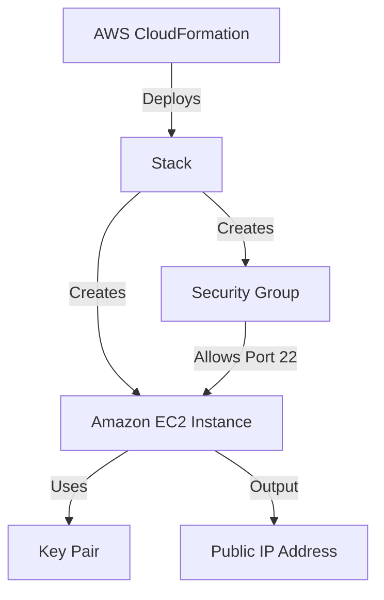

# ☁️ AWS CloudFormation: EC2 Provisioning

A comprehensive guide to automating AWS infrastructure using **CloudFormation**. This project demonstrateshow to provision a secure EC2 instance using Infrastructure as Code (IaC) principles.

---

## 📌 Overview

This project showcases the power of **AWS CloudFormation** to automate the deployment of virtual servers. By using a declarative YAML template, we ensure that our infrastructure is repeatable, version-controlled, and easy to manage.

### 🏗️ Architecture

The following diagram illustrates the resources provisioned by this stack:

---

## 🛠️ Resources Provisioned

| Service                | Resource Name     | Description                                 |
| :--------------------- | :---------------- | :------------------------------------------ |
| **AWS CloudFormation** | `Stack`           | The management unit for all resources.      |
| **Amazon EC2**         | `MyEC2Instance`   | A `t2.micro` instance (Free Tier eligible). |
| **VPC / Subnet**       | `Default`         | Uses the default network configuration.     |
| **Security Group**     | `MySecurityGroup` | Allows SSH (Port 22) access.                |

---

## 📂 Template Structure: `ec2-create.yml`

The CloudFormation template follows a structured approach:

1.  **AWSTemplateFormatVersion**: Specifies the capabilities of the template.
2.  **Description**: A human-readable comment about the stack.
3.  **Resources**: The core section where AWS services are defined.
    - `MySecurityGroup`: Configures firewall rules.
    - `MyEC2Instance`: Configures the server, AMI, and key pair.
4.  **Outputs**: Returns the Public IP of the instance after deployment.

---

## 🚀 Deployment Guide

Follow these steps to deploy the infrastructure:

1.  **Login**: Access the [AWS Management Console](https://console.aws.amazon.com/).
2.  **Navigate**: Go to the **CloudFormation** service.
3.  **Create Stack**:
    - Click **Create stack** > **With new resources (standard)**.
    - Select **Upload a template file** and choose `ec2-create.yml`.
4.  **Configure**:
    - Enter a **Stack name** (e.g., `Learning-CFN-EC2`).
    - Review the parameters and click **Next**.
5.  **Provision**: Click **Submit** and wait for the status to show `CREATE_COMPLETE`.

---

## ✅ Post-Deployment Verification

Once the stack is created:

1.  Go to the **Outputs** tab in the CloudFormation console to find the `InstancePublicIP`.
2.  Navigate to the **EC2 Dashboard** to see your running instance.
3.  Ensure the **Security Group** is correctly attached.

---

## 🧹 Cleanup

To avoid unnecessary costs, always delete your stack when finished:

- Select the stack in the CloudFormation console.
- Click **Delete** > **Delete stack**.
- _CloudFormation will automatically remove all associated resources._

---

## 🎓 Learning Outcomes

- [x] Understanding **Infrastructure as Code (IaC)**.
- [x] Mastered CloudFormation **YAML syntax**.
- [x] Learned to manage infrastructure as **Stacks**.
- [x] Implemented **Dynamic AMI** fetching via SSM Parameters.
- [x] Automated **Security Group** association.

---

_Created with ❤️ by agravi987 during AWS Learning Journey._
