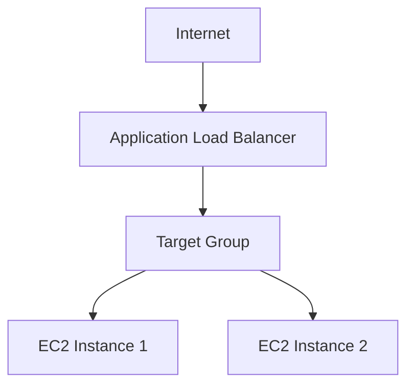

# 📘 Project: Deploy Web App using EC2 + Application Load Balancer (ALB)

## 🏗️ 1️⃣ Architecture Overview



- **ALB** distributes traffic.
- **EC2 instances** host the web app.
- **Target group** performs health checks.

---

## 🌍 2️⃣ Create Security Groups (VERY IMPORTANT)

We will create two security groups.

### 🟢 A. Security Group for ALB

**Steps:**

1. Go to **EC2** → **Security Groups**.
2. Click **Create Security Group**.
3. **Name:** `ALB-SG`.
4. **VPC:** Select your default VPC.
5. **Inbound Rules:**

| Type | Port | Source    | Description                              |
| ---- | ---- | --------- | ---------------------------------------- |
| HTTP | 80   | 0.0.0.0/0 | ✅ Allows internet traffic to reach ALB. |

6. **Outbound:** Leave default (Allow all).
7. Click **Create**.

### 🟢 B. Security Group for EC2

**Steps:**

1. Create another security group.
2. **Name:** `EC2-SG`.
3. **VPC:** Same VPC.
4. **Inbound Rules:**

| Type | Port | Source   | Description                                            |
| ---- | ---- | -------- | ------------------------------------------------------ |
| HTTP | 80   | `ALB-SG` | ⚠️ IMPORTANT: Select the ALB security group as source. |

> **Note:** This means only the ALB can access the EC2 instances. There is no direct public access.

5. **Outbound:** Default (Allow all).
6. Click **Create**.

---

## 💻 3️⃣ Launch EC2 Instances

We will launch 2 instances.

**Steps:**

1. Go to **EC2** → **Launch Instance**.
2. **Name:** `WebServer-1`.
3. **AMI:** Amazon Linux 2.
4. **Instance type:** `t2.micro`.
5. **Key pair:** Select or create one.
6. **Network settings:**
   - Select default VPC.
   - Enable **Auto-assign Public IP**.
   - **Security Group:** Select `EC2-SG`.
7. **📜 User Data Script:**
   Paste this in **Advanced Details** → **User Data**:

   ```bash
   #!/bin/bash
   yum update -y
   yum install httpd -y
   systemctl start httpd
   systemctl enable httpd

   INSTANCE_ID=$(curl http://169.254.169.254/latest/meta-data/instance-id)

   echo "<html>
   <head><title>ALB Test</title></head>
   <body style='background-color:lightgreen; text-align:center;'>
   <h1>Application Load Balancer Test 🚀</h1>
   <h2>Instance ID: $INSTANCE_ID</h2>
   </body>
   </html>" > /var/www/html/index.html
   ```

8. **Launch instance.**

**Repeat same steps for second instance:**

1. **Name:** `WebServer-2`.
2. **Security Group:** Same (`EC2-SG`).
3. **User Data:** Same script.
4. Wait until both are **Running**.

---

## 🎯 4️⃣ Create Target Group

1. Go to **EC2** → **Target Groups**.
2. Click **Create Target Group**.
3. **Choose:**
   - **Type:** Instances
   - **Protocol:** HTTP
   - **Port:** 80
   - **VPC:** Same VPC
4. **Health Check:**
   - **Protocol:** HTTP
   - **Path:** `/`
   - Keep defaults.
5. Click **Next**.
6. **Register Targets:**
   - Select both EC2 instances.
   - Click **Include as pending below**.
7. Click **Create Target Group**.
8. Wait until **Target status** becomes **Healthy**.

---

## ⚖️ 5️⃣ Create Application Load Balancer

1. Go to **EC2** → **Load Balancers**.
2. Click **Create Load Balancer**.
3. Choose **Application Load Balancer**.
4. **Basic Configuration:**
   - **Name:** `My-ALB`
   - **Scheme:** Internet-facing
   - **IP type:** IPv4
5. **Network Mapping:**
   - Select same VPC.
   - Select at least **2 public subnets** (ALB requires minimum 2 subnets).
6. **Security Groups:**
   - Select `ALB-SG`.
7. **Listener:**
   - **Protocol:** HTTP
   - **Port:** 80
   - **Forward to:** Select your Target Group.
8. Click **Create Load Balancer**.
9. Wait until state = **Active**.

---

## 🌐 6️⃣ Test the Setup

1. Go to **ALB**.
2. Copy **DNS name**.
3. Paste in browser.
4. Refresh multiple times.

**You should see:**

```
Instance ID: i-xxxx
Instance ID: i-yyyy
```

That means load balancing is working! 💥

---

## 🧪 7️⃣ Testing Scenarios (Very Important Practice)

Try these:

- ✅ **Stop one EC2 instance:** ALB should automatically route to the healthy instance only.
- ✅ **Terminate one instance:** Check Target Group health.
- ✅ **Change health check path:**
  - Change path from `/` to `/test`.
  - Watch instance become unhealthy.

---

## 🔒 8️⃣ Security Validation

Make sure:

- ALB allows HTTP from anywhere.
- EC2 allows HTTP **only** from `ALB-SG`.
- EC2 is not publicly accessible directly.

👉 **Try accessing EC2 public IP directly** — it should fail if configured correctly.
That means architecture is secure 😎

---

## 🧹 9️⃣ Cleanup (Avoid AWS Charges)

When done:

1. Delete **Load Balancer**.
2. Delete **Target Group**.
3. Terminate **EC2 instances**.
4. Delete **Security Groups** (if not in use).

> Always clean up. Real engineers don’t leak money 💸😂

---


