# ☁️ Static Website Hosting on AWS S3 �


Welcome to my **Static Website Hosting** project! 🎉 This repository demonstrates how to host a simple, cost-effective, and fully serverless website using **Amazon S3**. No servers to manage, just pure cloud magic! ✨

---

## 🎯 **Objective**

To host a basic static website using Amazon S3 with the following features:

- ✅ Separate `index.html` file
- ✅ Separate `style.css` file
- ✅ **Static Website Hosting** enabled
- ✅ Proper **Bucket Policy** configuration for public access

---

## 🏗️ **Architecture Overview**

Here's how the magic happens:

```mermaid
graph LR
    User[👤 User Browser] -->|HTTP Request| S3[🪣 Amazon S3 Bucket]
    S3 -->|Serves Static Content| User
    subgraph "AWS Cloud ☁️"
    S3
    end
```



**Key Features:**

- 🚫 **No EC2 Instances**
- 🚫 **No Load Balancers**
- 🚫 **No Auto Scaling Groups**
- 💯 **Fully Serverless & Cost-Effective**

---

## 📁 **Project Structure**

Your local folder structure should look like this:

```bash
project-folder/
│
├── index.html  # 🏠 Main HTML file
└── style.css   # 🎨 Styling file
```

> **Note:** Both files are stored at the root level, and `index.html` links to `style.css` using a relative path.

---

## 🚀 **Step-by-Step Implementation Guide**

Follow these steps to deploy your own static website! 👇

### **Step 1: Create an S3 Bucket 🪣**

1. Log in to the **AWS Console**.
2. Navigate to **S3**.
3. Click on **Create Bucket**.
4. **Configuration**:
   - **Bucket Name**: Must be globally unique (e.g., `my-awesome-website-123`).
   - **Region**: Choose your preferred region closest to your users.
   - **Object Ownership**: ACLs disabled (recommended).
   - **Block Public Access**: Keep enabled for now (we'll change this in Step 2).
5. Click **Create Bucket**.

### **Step 2: Disable Block Public Access 🔓**

1. Open your newly created bucket.
2. Go to the **Permissions** tab.
3. Scroll down to **Block Public Access (bucket settings)**.
4. Click **Edit**.
5. **Uncheck** `Block all public access`.
6. Confirm the warning prompt.
7. Click **Save changes**.

> ⚠️ **Important:** This step is crucial to allow the public internet to access your website files.

### **Step 3: Upload Website Files 📤**

1. Go to the **Objects** tab.
2. Click **Upload**.
3. Select your `index.html` and `style.css` files.
4. Click **Upload**.
   - Ensure both files are at the root level of the bucket.

### **Step 4: Enable Static Website Hosting 🌐**

1. Go to the **Properties** tab.
2. Scroll to the bottom to find **Static website hosting**.
3. Click **Edit**.
4. Select **Enable**.
5. **Configuration**:
   - **Index document**: `index.html`
   - **Error document**: `index.html` (optional, for basic SPA routing).
6. Click **Save changes**.

🎉 **Copy the Bucket Website Endpoint URL!** You'll need this later.

### **Step 5: Add Bucket Policy (Crucial Step!) 🔐**

1. Go to **Permissions** -> **Bucket Policy**.
2. Click **Edit** and paste the following policy:

```json
{
  "Version": "2012-10-17",
  "Statement": [
    {
      "Sid": "PublicReadAccess",
      "Effect": "Allow",
      "Principal": "*",
      "Action": "s3:GetObject",
      "Resource": "arn:aws:s3:::YOUR-BUCKET-NAME/*"
    }
  ]
}
```

> ✍️ **Action Required:** Replace `YOUR-BUCKET-NAME` with your actual bucket name. 3. Click **Save changes**.

---

## 🌍 **Test Your Website**

1. Go to **Properties** -> **Static website hosting**.
2. Click on the **Bucket Website Endpoint** URL.
3. **Expected Result**:
   - Your website loads smoothly! 🎈
   - CSS styling is applied correctly. 🎨

---

## 🧠 **Key Learning Concepts**

- **1️⃣ Object Storage Behavior**: S3 stores _objects_, not files. Each object has a unique key (path) and permissions.
- **2️⃣ Relative File Linking**: Since files are at the root, we use `href="style.css"`. If in a folder, it would be `href="css/style.css"`.
- **3️⃣ Website Endpoint vs. Object URL**:
  - ❌ **S3 Object URL**: `https://bucket-name.s3.region.amazonaws.com/index.html` (May not route correctly).
  - ✅ **Website Endpoint**: `http://bucket-name.s3-website-region.amazonaws.com` (Supports index documents and error routing).

---

## 🔎 **Troubleshooting Common Errors**

| Issue                  | Likely Cause          | Solution                                |
| :--------------------- | :-------------------- | :-------------------------------------- |
| **Access Denied** 🚫   | Missing Bucket Policy | Add the public read policy from Step 5. |
| **CSS Not Loading** 🎨 | Wrong File Path       | Check your `href` path in HTML.         |
| **403 Forbidden** 🔒   | Public Access Blocked | Ensure "Block Public Access" is OFF.    |

---

## 🧹 **Cleanup (Avoid Extra Charges)**

Don't forget to clean up if you're done testing! 💸

1. **Empty the Bucket**: Delete all objects inside.
2. **Delete the Bucket**: Remove the bucket entirely.

_Created with ❤️ by a Cloud Enthusiast ☁️_
